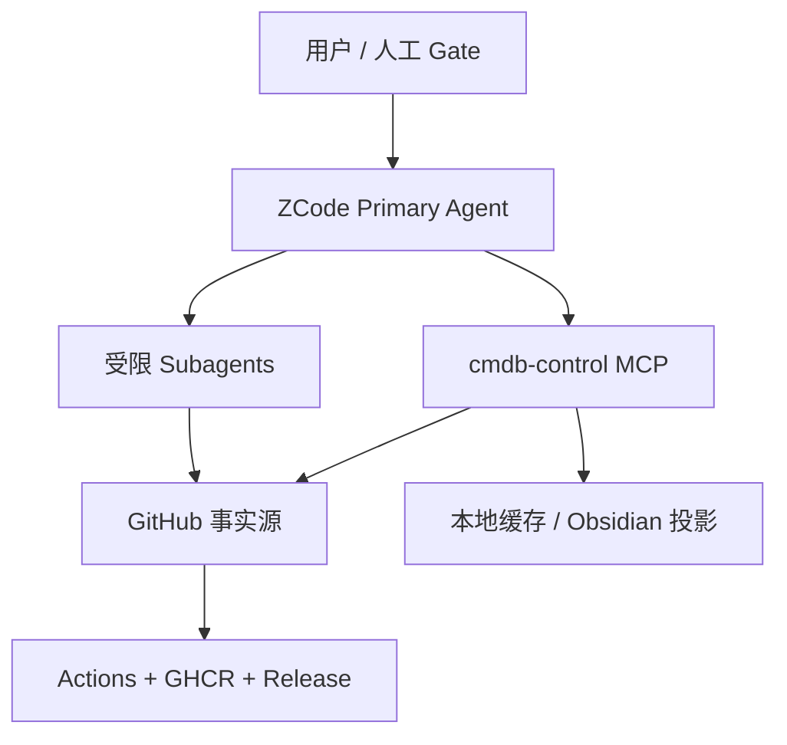
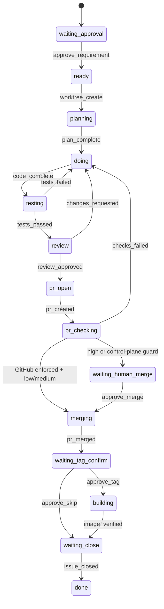

# CMDB 项目：ZCode AI 研发流水线规范

**版本：** V2.0

**日期：** 2026-08-31

**适用范围：** CMDB 项目研发

## 1. 核心架构



V2 将职责分成四层：

| 层 | 职责 |
| --- | --- |
| Primary Agent | 唯一 Orchestrator；理解命令、调度 Worker、呈现人工 Gate |
| `cmdb-control` MCP | 状态迁移、GitHub 同步、worktree、一次性授权、交付证据核验 |
| Subagents | Planner / Coder / Tester / Reviewer / Build Checker 的有界工作 |
| Hooks | Session 注入约束、PreToolUse 保护敏感操作、Stop 阻止虚假 Done |

Subagent 不得启动 Subagent，也没有 MCP 控制面工具。

## 2. 事实源与投影

优先级：

```text
GitHub Issue 机器状态 + PR/Actions/GHCR 实际事实
> Git branch/commit
> .cmdb-dev/state.json 本地缓存
> plan/ Markdown 只读投影
> AI 推断
```

GitHub Issue 评论包含 `cmdb-dev-state:v2` 机器块，状态标签为
`cmdb:<state>`。`.cmdb-dev/state.json` 和 `plan/` 均可从 GitHub 恢复，
不得反向覆盖更新的 GitHub 状态。

## 3. Issue 先于编码

`/cmdb_dev` 的固定顺序：

1. `cmdb_preflight`；
2. Primary Agent 调度只读 Planner；
3. `cmdb_open_work_item` 先创建 GitHub Issue；
4. 用 Issue Number 生成 `REQ-<number>` 或 `BUG-<number>`；
5. 写入状态与投影；
6. 停在 `waiting_approval`。

Gate A 前禁止创建开发 worktree、修改业务代码、创建 PR 或合并。

## 4. 人工 Gate

### Gate A：需求批准

```text
/cmdb_approve REQ-123
```

批准记录必须是 `approve_requirement`，actor 使用
`human:<identity>`。随后才创建 `.cmdb-dev/worktrees/REQ-123` 和独立分支。

### Gate B：高风险合并

破坏性迁移、数据删除/覆盖、认证权限、不兼容 API、影响既有数据的唯一性
规则和大范围破坏性批处理均默认高风险：

```text
/cmdb_merge_approve REQ-123
```

Gate B 不能绕过 PR 工作流检查。不具备付费分支保护的私有仓库统一使用
控制面校验，并且所有风险等级都必须经过 Gate B。

### Gate C：Tag / 镜像交付

合并后必须停在 `waiting_tag_confirm`：

```text
/cmdb_tag_approve REQ-123 v2.1.0
/cmdb_tag_approve REQ-123 skip
```

`skip` 仅适用于 Planner 已持久化
`delivery_required: false` 且 `skip_allowed: true` 的非运行时改动。

Coder → Tester → Reviewer 之间没有额外人工 Gate。

## 5. 状态机



任意非终态可因证据充分的异常进入 `blocked`。`tests_failed`、
`changes_requested`、`checks_failed` 合计自动返工最多 3 轮；下一次失败必须
阻塞并等待人工处理。

## 6. 独立 worktree 与权限护栏

每个 Work Item 固定使用：

```text
.cmdb-dev/worktrees/<ID>
branch: cmdb/<lowercase-id>
```

Coder、Tester、Reviewer 必须验证收到的路径，只在该 worktree 工作。

以下 shell 操作由 PreToolUse Hook 保护：

- `git push`；
- git tag 创建/修改/删除；
- `gh pr merge`；
- `gh issue close`。

Primary Agent 在操作前调用 `cmdb_authorize`，令牌绑定 Work Item、状态修订、
动作和过期时间，只能使用一次。每个 Bash 调用只允许一种受保护动作。

## 7. PR 质量门

PR Body 使用 `Refs #<issue>`，不得使用 `Closes` / `Fixes`，避免合并时过早
关闭 Issue。所有合并都必须满足：

- `CMDB PR Checks / verify` 明确成功；
- Tester passed、Reviewer approved；
- 没有合并阻塞项。

缺失、pending、skipped、neutral、cancelled、timed out 或 failed 均不得合并。

合并守卫有两种：

1. `github_required_checks`：公开仓库或付费计划由 GitHub 服务端强制，
   低/中风险可以自动合并；
2. `control_plane_verified`：GitHub Free 私有仓库由
   `cmdb_verify_pr_checks` 核对成功检查和精确 Head SHA，所有风险等级停在
   Gate B，合并命令必须携带 `--match-head-commit <SHA>`。

第二种模式保护通过插件执行的合并，但无法阻止管理员在 GitHub 页面手工
绕过。需要服务端不可绕过保证时仍需 GitHub 付费分支保护。

## 8. 可验证镜像交付

Tag 只接受严格 `vMAJOR.MINOR.PATCH`（可带合法 prerelease），且 Tag commit
必须属于当前默认分支。`CMDB Build Image`：

- 将 GHCR image 名转换为小写；
- 构建并推送镜像；
- 生成 SBOM 和 maximum provenance；
- 上传 `cmdb-delivery-<tag>` Actions artifact；
- 将同一 `delivery-metadata.json` 发布到 GitHub Release。

Build Checker 必须独立核对：

1. Work Item merged SHA；
2. Actions artifact 元数据；
3. GitHub Release 元数据；
4. GHCR package/remote manifest 的不可变 `sha256:` Digest；
5. SBOM 与 provenance attestation 的独立 `sha256:` manifest Digest。

日志或 workflow success 单独不足以证明交付。只有
`cmdb_verify_delivery` 接受全部一致证据后，才能记录 `image_verified`。

## 9. MCP 工具

| 工具 | 用途 |
| --- | --- |
| `cmdb_preflight` | 只读检查 Git/GitHub/保护规则/工作流 |
| `cmdb_initialize` | 初始化状态、投影和 Actions 模板 |
| `cmdb_open_work_item` | Issue-first 创建工单 |
| `cmdb_transition` | 执行单个有证据的状态事件 |
| `cmdb_status` / `cmdb_validate` | 刷新和验证状态 |
| `cmdb_sync` / `cmdb_hydrate` | GitHub 与本地缓存同步 |
| `cmdb_worktree_create` | 创建独立 worktree 并记录路径 |
| `cmdb_verify_pr_checks` | 核对 PR Head/检查并选择 GitHub 或控制面守卫 |
| `cmdb_authorize` | 发放一次性敏感操作令牌 |
| `cmdb_verify_delivery` | 交叉核验完整供应链证据 |

MCP stdio server 同时支持当前 `2026-07-28` 发现协议和旧版初始化协议。

## 10. Slash Commands

```text
/cmdb_check
/cmdb_init
/cmdb_dev <自然语言需求或 Bug>
/cmdb_approve <REQ-xxx/BUG-xxx>
/cmdb_merge_approve <REQ-xxx/BUG-xxx>
/cmdb_tag_approve <REQ-xxx/BUG-xxx> [vX.Y.Z|skip]
/cmdb_status [REQ-xxx/BUG-xxx]
/cmdb_resume <REQ-xxx/BUG-xxx>
```

命令只负责 Primary Agent 编排；状态和权限动作均通过 MCP 控制面。

## 11. Definition of Done

通用条件：Requirement approved、Coder completed、Tester passed、Reviewer
approved、PR workflow checks passed、merge guard verified、PR merged、Issue closed。

运行时交付还必须具备：人工 Gate C、严格 SemVer Tag、merged SHA 一致、GHCR
Digest 一致、Release 元数据一致、SBOM verified、provenance verified。

非运行时 skip 路径必须具备：Planner 持久化允许、人工 Gate C、
`build_status: skipped`。

## 12. 项目边界

本流程负责需求 → Issue → Code → Test → Review → PR → Merge → Tag → Image。
不负责 Kubernetes 部署、生产上线、生产验证或生产回滚。

## 13. 官方参考

- <https://zcode.z.ai/en/docs/plugin>
- <https://zcode.z.ai/en/docs/mcp-services>
- <https://zcode.z.ai/en/docs/hooks>
- <https://zcode.z.ai/en/docs/subagents>
- <https://modelcontextprotocol.io/specification/2026-07-28>
