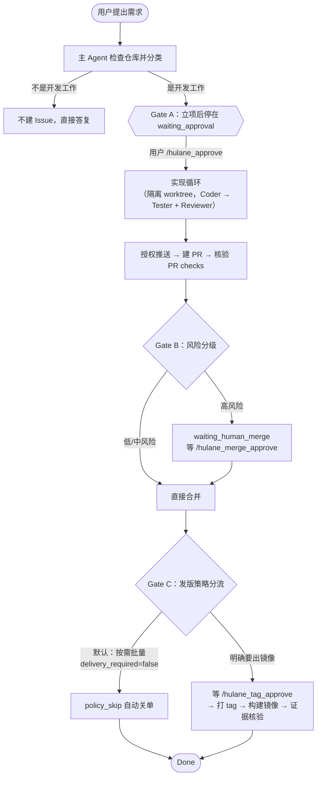
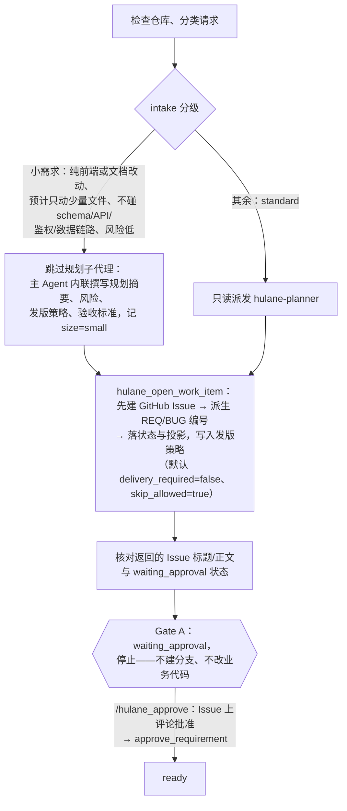
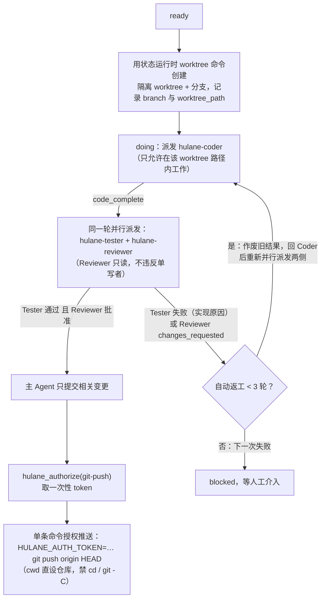
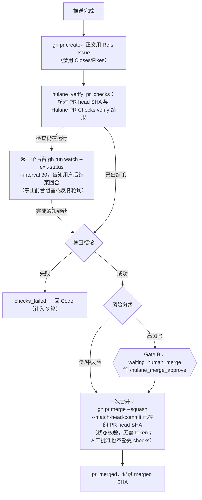
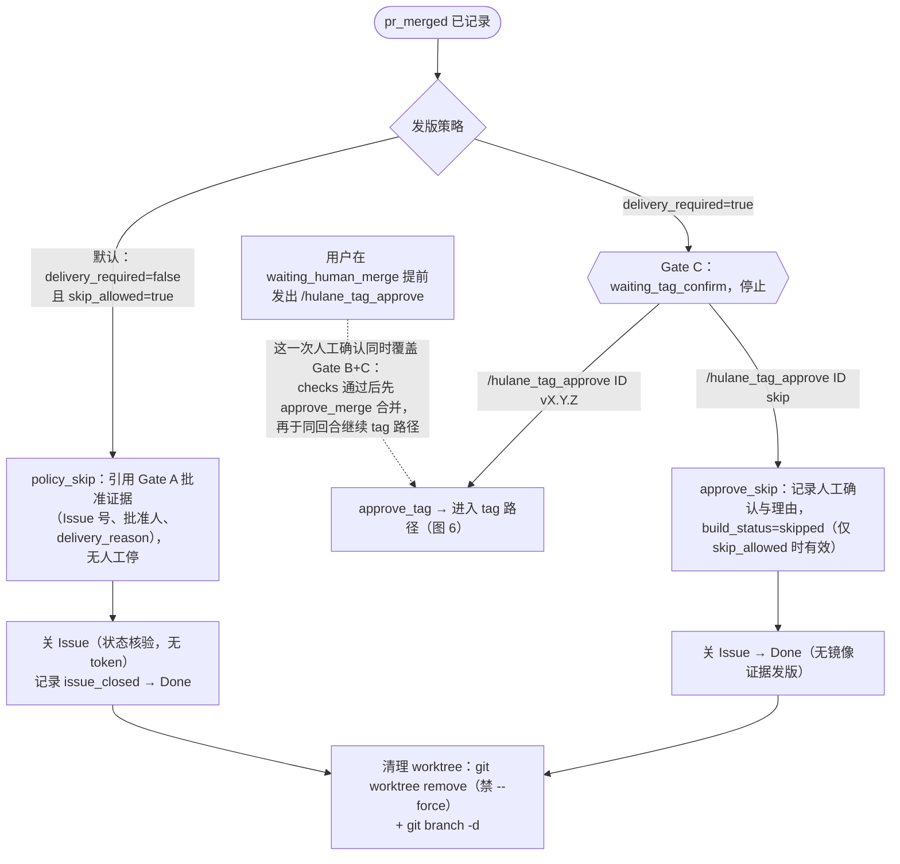
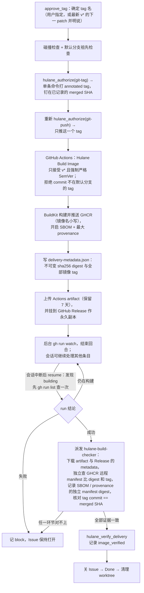
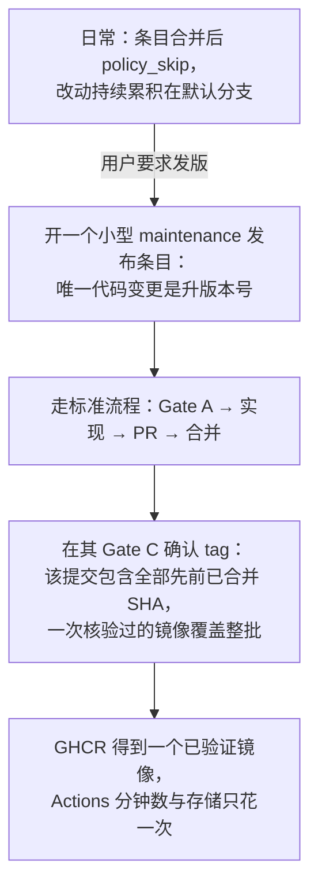
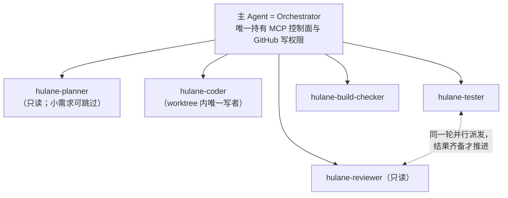
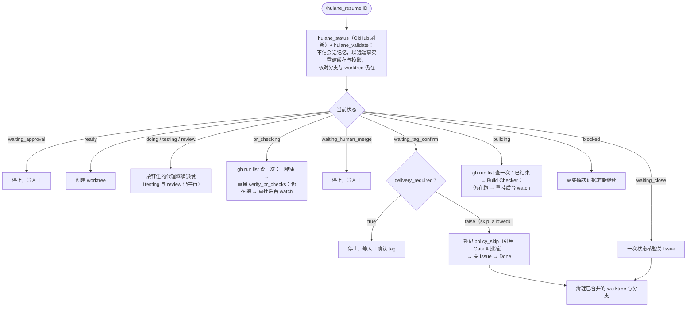

# Hulane 全流程图

配套《Hulane_ZCode_AI_Dev_Workflow.md》的操作流程图集。状态机原图见该文档第 5 节；
本文按"需求 → 实现 → 合并 → 交付"补齐各阶段的操作流、守卫机制与断线恢复。
依据 V3.0.1 的 `skills/hulane-development/SKILL.md`、`docs/IMAGE_DELIVERY.md`、
`commands/*` 与 `agents/*` 整理。

---

## 1. 总览：从需求到 Done

全程只有三个可能的人工停点：Gate A（必停）、Gate B（仅高风险）、Gate C（仅要求出镜像的条目）。
默认发版策略下，一个小需求从提出到 Done 只停 Gate A 一次。

---

## 2. 立项与 Gate A（含 small/standard 分流）

要点：

- 立项先有 GitHub Issue， Work Item 编号由 Issue 号派生（`REQ-<n>` / `BUG-<n>`）。
- 小需求专属的简化只有"跳过 planner 派发"一处，其余状态机步骤与 standard 完全一致；
  Coder 阶段发现范围膨胀会立即把 size 打回 standard 并补派 planner。
- 发版策略在立项时固化：只有用户明确要求本次出镜像才设
  `delivery_required=true、skip_allowed=false`。

---

## 3. 实现循环（worktree 隔离 + 三轮返工上限）

要点：

- 永远不向同一个 worktree 派两个写者；并行只发生在"Tester + 只读 Reviewer"。
- `tests_failed`、`changes_requested`、`checks_failed` 合计自动返工最多 3 轮，
  第 4 次失败必须阻塞等人工。
- 推送是受守卫保护的特权操作：token 一次性、命令形状精确、禁止批量合并多条操作。

---

## 4. PR 检查与合并（Gate B）

私有仓库无付费分支保护时，`hulane_verify_pr_checks` 记录 `control_plane_verified`
替代 GitHub 侧强制；checks 缺失或非成功一律阻塞。

---

## 5. 交付分流（合并后的四种走向）

要点：

- 默认路径（policy_skip）没有任何人工停点，因为 Gate A 已经批准过这个策略。
- 手动 `skip` 只是给"会话死在合并与关单之间"这类卡在 waiting_tag_confirm
  的条目的人工兜底。
- 镜像构建 workflow 缺失永远不构成自动 skip 的理由。

---

## 6. Tag 构建与证据核验（含断线恢复）

核心原则：Actions 绿勾与日志成功永远不是交付证据；只有 Actions artifact、
Release 资产、GHCR 远程 manifest、SBOM/provenance 证据与 merged SHA
五方一致，才允许 `image_verified` 并关单。

---

## 7. 按需批量发版

发布是显式的批量事件，不是每次合并的仪式——这是对 GitHub 免费套餐
（Actions 分钟数、GHCR 存储）配额的尊重。要立即出某一个条目，也可以
就在该条目自己的 Gate C 确认 tag。

---

## 8. 授权与守卫机制

```mermaid
flowchart TD
  CMD["受保护命令：git push / git tag /<br>gh pr merge / gh issue close"] --> G["PreToolUse 守卫拦截"]
  G -->|"push 与 tag 变更"| TK["需要一次性 token：<br>紧挨命令前调 hulane_authorize，<br>HULANE_AUTH_TOKEN 只用于这一条命令"]
  G -->|"merge 与 issue close"| SV["状态核验，无需 token：<br>条目只可能在 merging/waiting_close<br>（全部检查已过），guard 自证状态、<br>PR/Issue 号，合并还钉住 head SHA"]
  TK --> S{"命令形状精确？"}
  S -->|"cwd 直设仓库、单条单操作、<br>token 与动作一一对应"| OK["放行，token 用后即焚"]
  S -->|"cd 或 git -C 间接、多条操作、<br>token 对错动作、复用或过期"| REJ["拒绝：只允许修正后重发单条命令<br>（push/tag 需重新取 token），<br>禁止扩宽命令或链式补救"]
```

---

## 9. 子代理编排拓扑

约束：

- 子代理永远不得再派生子代理。
- 子代理工具清单不含 MCP 控制面工具，永不接触状态变更与授权。
- Planner 保持只读；Coder、Tester、Reviewer 只在记录的 worktree 路径内活动。

---

## 10. 断线恢复（/hulane_resume）

原则：恢复永远从 GitHub 事实出发（Issue 状态评论 + 实际 Issue/PR/Actions
事实优先），一次查询定性，异步等待一律用后台任务加结束回合，绝不开前台轮询。
