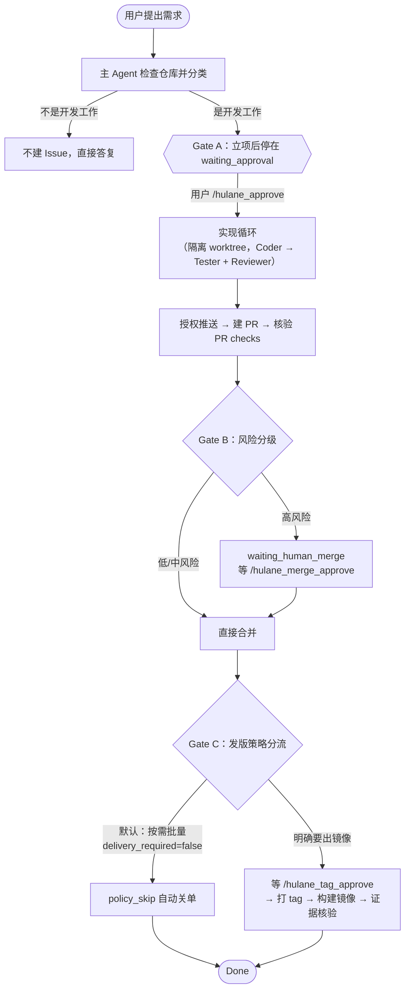
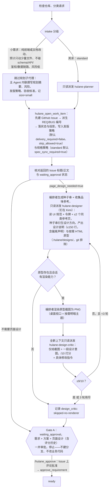
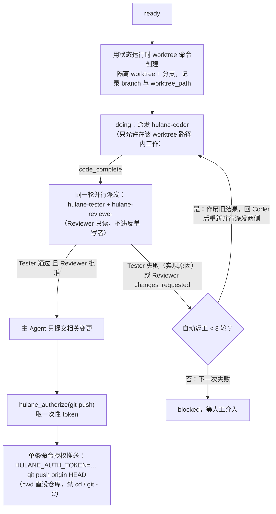
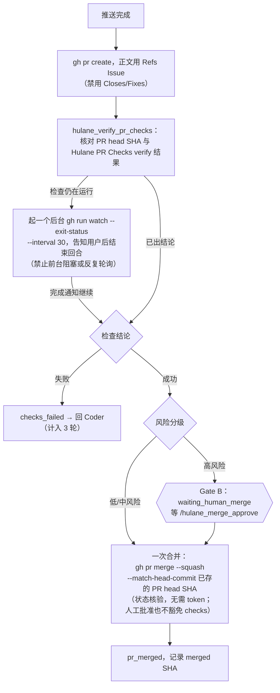
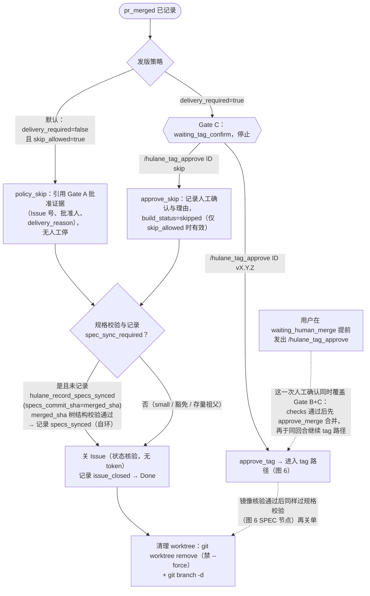
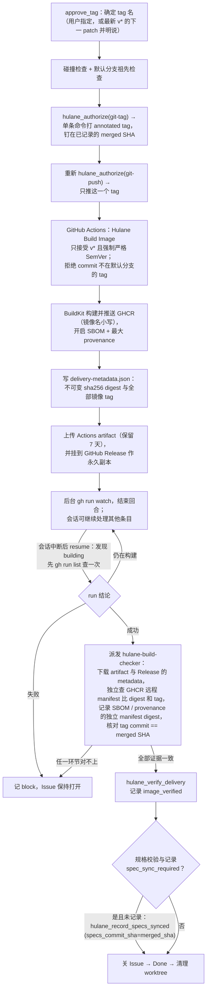
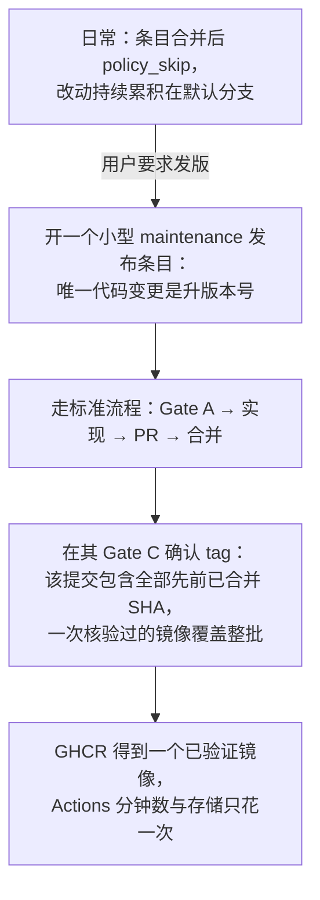
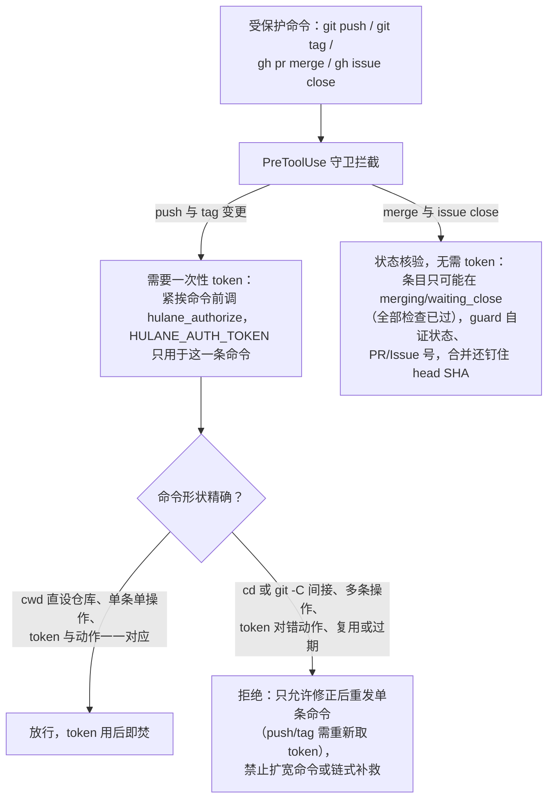
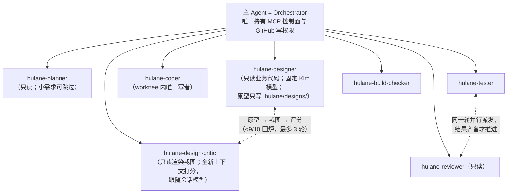
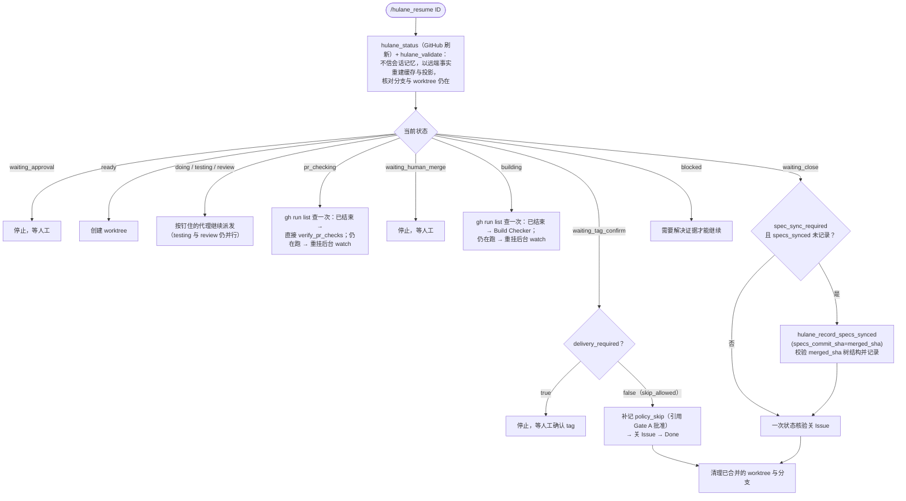

# Hulane 全流程图

配套《Hulane_ZCode_AI_Dev_Workflow.md》的操作流程图集。状态机原图见该文档第 5 节；
本文按"需求 → 实现 → 合并 → 交付"补齐各阶段的操作流、守卫机制与断线恢复。
依据 V3.6.0 的 `skills/hulane-development/SKILL.md`、`docs/IMAGE_DELIVERY.md`、
`commands/*` 与 `agents/*` 整理。

---

## 1. 总览：从需求到 Done

```mermaid
flowchart TD
  U(["用户提出需求"]) --> CL["主 Agent 检查仓库并分类"]
  CL -->|"不是开发工作"| NO["不建 Issue，直接答复"]
  CL -->|"是开发工作"| GA
  GA{{"Gate A：立项后停在 waiting_approval"}} -->|"用户 /hulane_approve"| IMPL["实现循环<br>（隔离 worktree，Coder → Tester + Reviewer）"]
  IMPL --> PR["授权推送 → 建 PR → 核验 PR checks"]
  PR --> GB{"Gate B：风险分级"}
  GB -->|"低/中风险"| MG["直接合并"]
  GB -->|"高风险"| GHM["waiting_human_merge<br>等 /hulane_merge_approve"] --> MG
  MG --> POL{"Gate C：发版策略分流"}
  POL -->|"默认：按需批量<br>delivery_required=false"| SKIP["policy_skip 自动关单"] --> DONE(["Done"])
  POL -->|"明确要出镜像"| TAG["等 /hulane_tag_approve<br>→ 打 tag → 构建镜像 → 证据核验"] --> DONE
```

全程只有三个可能的人工停点：Gate A（必停）、Gate B（仅高风险）、Gate C（仅要求出镜像的条目）。
默认发版策略下，一个小需求从提出到 Done 只停 Gate A 一次。
spec_sync_required 工单（standard 默认开启，small 恒关闭）在关单前还必须通过
规格校验与记录环节（第 5 节"规格校验与记录"节点），由状态机与守卫双层强制。

---

## 2. 立项与 Gate A（含 small/standard 分流）

```mermaid
flowchart TD
  CL["检查仓库、分类请求"] --> SZ{"intake 分级"}
  SZ -->|"小需求：纯前端或文档改动、<br>预计只动少量文件、不碰 schema/API/<br>鉴权/数据链路、风险低"| SM["跳过规划子代理：<br>主 Agent 内联撰写规划摘要、风险、<br>发版策略、验收标准，记 size=small"]
  SZ -->|"其余：standard"| PLN["只读派发 hulane-planner"]
  SM --> OWI["hulane_open_work_item：<br>先建 GitHub Issue → 派生 REQ/BUG 编号<br>→ 落状态与投影，写入发版策略<br>（默认 delivery_required=false、skip_allowed=true）<br>与规格策略（standard 默认 spec_sync_required=true）"]
  PLN --> OWI
  OWI --> V["核对返回的 Issue 标题/正文<br>与 waiting_approval 状态"]
  V -->|"page_design_needed=true"| DSN["编排者生成种子串 + 收集品味参考，<br>只读派发 hulane-designer（钉在 Kimi）：<br>读 UI 规范 + 令牌 + ≤2 个同类参考页，<br>种子串衍生设计方向，产出设计说明（≤150 行，<br>含偏离声明）与按需 HTML 原型<br>（.hulane/designs/，git 排除）"]
  V -->|"不需要页面设计"| GA
  DSN --> CRT{"原型存在且会话<br>有渲染能力？"}
  CRT -->|否| NT["记录 design_critic:<br>skipped-no-renderer"]
  CRT -->|是| SHOT["编排者渲染原型截图为 PNG<br>（桌面视口 + 按需明暗主题）"]
  SHOT --> CR["全新上下文只读派发 hulane-design-critic：<br>仅给截图 + 一段设计意图，/10 打分<br>+ 具体修改指令"]
  CR --> SC{"≥9/10？"}
  SC -->|否，且 <3 轮| DSN
  SC -->|是 或 3 轮用尽| NT
  NT --> GA{{"Gate A：waiting_approval，<br>需求 + 方案 + 页面设计（含评分历史）<br>一并审批，停止——不建分支、不改业务代码"}}
  GA -->|"/hulane_approve：Issue 上评论批准<br>→ approve_requirement"| RDY["ready"]
```

要点：

- 立项先有 GitHub Issue， Work Item 编号由 Issue 号派生（`REQ-<n>` / `BUG-<n>`）。
- 小需求专属的简化只有"跳过 planner 派发"一处，其余状态机步骤与 standard 完全一致；
  Coder 阶段发现范围膨胀会立即把 size 打回 standard 并补派 planner。注意
  `spec_sync_required` 的写入通道在 Gate A 后已收口（仅 approve_requirement 可改），
  膨胀工单保持 false，在投影 `## 规格关联` 记"spec debt（pending）"，
  由下一个触碰该 capability 的 standard 工单吸收。
- 发版策略在立项时固化：只有用户明确要求本次出镜像才设
  `delivery_required=true、skip_allowed=false`。
- 规格层（V3.6.0 起）：planner 读取被触碰 capability 的主规格
  （`openspec/specs/<capability>/spec.md`，缺失记 scope_questions），
  产出 spec_delta_draft 并把验收标准从 Scenario 导出；delta 全文（过长时
  摘要+路径）随 Gate A 审批包一并评审。纯基建/纯文档的 standard 工单由
  planner 显式豁免（spec_sync_required=false）并记录原因；small 恒 false。
- 页面设计并入 Gate A 审批包，不新增人工停点；未触发设计的条目
  （含全部 small）零设计开销。设计钉死既有原型/组件/令牌，新视觉词汇
  必须附偏离声明由人工裁决；Kimi 派发失败自动降级会话模型并注明。
- 设计回环（V3.5.0 起）：种子串破默认审美，critic 只看渲染截图在全新上下文
  打分（<9/10 回炉修订，最多 3 轮），评分历史随设计说明一并进审批包；
  会话无渲染能力时降级为单趟设计并注明 skipped-no-renderer。

---

## 3. 实现循环（worktree 隔离 + 三轮返工上限）

```mermaid
flowchart TD
  RDY["ready"] --> WT["用状态运行时 worktree 命令创建<br>隔离 worktree + 分支，记录 branch 与 worktree_path"]
  WT --> COD["doing：派发 hulane-coder<br>（只允许在该 worktree 路径内工作）"]
  COD -->|"code_complete"| PAR["同一轮并行派发：<br>hulane-tester + hulane-reviewer<br>（Reviewer 只读，不违反单写者）"]
  PAR -->|"Tester 通过 且 Reviewer 批准"| CMT["主 Agent 只提交相关变更"]
  PAR -->|"Tester 失败（实现原因）<br>或 Reviewer changes_requested"| RW{"自动返工 < 3 轮？"}
  RW -->|"是：作废旧结果，回 Coder<br>后重新并行派发两侧"| COD
  RW -->|"否：下一次失败"| BLK["blocked，等人工介入"]
  CMT --> AUTH["hulane_authorize(git-push)<br>取一次性 token"]
  AUTH --> PUSH["单条命令授权推送：<br>HULANE_AUTH_TOKEN=… git push origin HEAD<br>（cwd 直设仓库，禁 cd / git -C）"]
```

要点：

- 永远不向同一个 worktree 派两个写者；并行只发生在"Tester + 只读 Reviewer"。
- spec_sync_required 工单的 Coder 同时在 worktree 内写决策史归档
  （`openspec/changes/archive/<ID>/`）并在同一 PR 内完成 delta→主规格智能合并
  （ADDED 追加/同名按 MODIFIED、MODIFIED 保留未提及 scenario、REMOVED 删整块、
  RENAMED 改名；只改触碰到的 capability）。
- Tester 以 delta Scenario 为用例来源并回报 scenario→覆盖矩阵；
  Reviewer 做 diff 与 delta 声明行为的行为对照。
- `tests_failed`、`changes_requested`、`checks_failed` 合计自动返工最多 3 轮，
  第 4 次失败必须阻塞等人工。
- 推送是受守卫保护的特权操作：token 一次性、命令形状精确、禁止批量合并多条操作。

---

## 4. PR 检查与合并（Gate B）

```mermaid
flowchart TD
  PUSH["推送完成"] --> PRC["gh pr create，正文用 Refs Issue<br>（禁用 Closes/Fixes）"]
  PRC --> CHK["hulane_verify_pr_checks：<br>核对 PR head SHA 与 Hulane PR Checks verify 结果"]
  CHK -->|"检查仍在运行"| WATCH["起一个后台 gh run watch --exit-status<br>--interval 30，告知用户后结束回合<br>（禁止前台阻塞或反复轮询）"]
  WATCH -->|"完成通知继续"| V2{"检查结论"}
  CHK -->|"已出结论"| V2
  V2 -->|"失败"| CF["checks_failed → 回 Coder（计入 3 轮）"]
  V2 -->|"成功"| RISK{"风险分级"}
  RISK -->|"低/中风险"| MG["一次合并：<br>gh pr merge --squash<br>--match-head-commit 已存的 PR head SHA<br>（状态核验，无需 token；<br>人工批准也不豁免 checks）"]
  RISK -->|"高风险"| GB{{"Gate B：waiting_human_merge<br>等 /hulane_merge_approve"}} --> MG
  MG --> MR["pr_merged，记录 merged SHA"]
```

私有仓库无付费分支保护时，`hulane_verify_pr_checks` 记录 `control_plane_verified`
替代 GitHub 侧强制；checks 缺失或非成功一律阻塞。

---

## 5. 交付分流（合并后的四种走向）

```mermaid
flowchart TD
  MR(["pr_merged 已记录"]) --> POL{"发版策略"}
  POL -->|"默认：delivery_required=false<br>且 skip_allowed=true"| PS["policy_skip：引用 Gate A 批准证据<br>（Issue 号、批准人、delivery_reason），<br>无人工停"]
  PS --> SPEC{"规格校验与记录<br>spec_sync_required？"}
  SPEC -->|"是且未记录<br>hulane_record_specs_synced<br>(specs_commit_sha=merged_sha)<br>merged_sha 树结构校验通过<br>→ 记录 specs_synced（自环）"| C1["关 Issue（状态核验，无 token）<br>记录 issue_closed → Done"]
  SPEC -->|"否（small / 豁免 / 存量祖父）"| C1
  POL -->|"delivery_required=true"| GAC{{"Gate C：waiting_tag_confirm，停止"}}
  GAC -->|"/hulane_tag_approve ID vX.Y.Z"| TAGP["approve_tag → 进入 tag 路径（图 6）"]
  GAC -->|"/hulane_tag_approve ID skip"| SK["approve_skip：记录人工确认与理由，<br>build_status=skipped（仅 skip_allowed 时有效）"]
  SK --> SPEC
  EARLY["用户在 waiting_human_merge 提前<br>发出 /hulane_tag_approve"] -.->|"这一次人工确认同时覆盖 Gate B+C：<br>checks 通过后先 approve_merge 合并，<br>再于同回合继续 tag 路径"| TAGP
  C1 --> HK["清理 worktree：git worktree remove（禁 --force）<br>+ git branch -d"]
  TAGP -.->|"镜像核验通过后同样过规格校验<br>（图 6 SPEC 节点）再关单"| HK
```

要点：

- 默认路径（policy_skip）没有任何人工停点，因为 Gate A 已经批准过这个策略。
- 手动 `skip` 只是给"会话死在合并与关单之间"这类卡在 waiting_tag_confirm
  的条目的人工兜底。
- 镜像构建 workflow 缺失永远不构成自动 skip 的理由。
- 规格校验与记录是三条关单路径（policy_skip / approve_skip / tag 镜像核验后）
  共用的硬前置：spec_sync_required 且 specs_synced 未记录时，状态机拒绝
  issue_closed、守卫拒绝 gh issue close；结构非法规格在
  hulane_record_specs_synced 处被拒绝，状态不动。

---

## 6. Tag 构建与证据核验（含断线恢复）

```mermaid
flowchart TD
  TAGP["approve_tag：确定 tag 名<br>（用户指定，或最新 v* 的下一 patch 并明说）"] --> PRE["碰撞检查 + 默认分支祖先检查"]
  PRE --> T1["hulane_authorize(git-tag) →<br>单条命令打 annotated tag，钉在已记录的 merged SHA"]
  T1 --> T2["重新 hulane_authorize(git-push) →<br>只推这一个 tag"]
  T2 --> CI["GitHub Actions：Hulane Build Image<br>只接受 v* 且强制严格 SemVer；<br>拒绝 commit 不在默认分支的 tag"]
  CI --> BLD["BuildKit 构建并推送 GHCR（镜像名小写），<br>开启 SBOM + 最大 provenance"]
  BLD --> META["写 delivery-metadata.json：<br>不可变 sha256 digest 与全部镜像 tag"]
  META --> ART["上传 Actions artifact（保留 7 天），<br>并挂到 GitHub Release 作永久副本"]
  ART --> BW["后台 gh run watch，结束回合；<br>会话可继续处理其他条目"]
  BW -->|"会话中断后 resume：发现 building<br>先 gh run list 查一次"| Q{"run 结论"}
  Q -->|"仍在构建"| BW
  Q -->|"成功"| BC["派发 hulane-build-checker：<br>下载 artifact 与 Release 的 metadata，<br>独立查 GHCR 远程 manifest 比 digest 和 tag，<br>记录 SBOM / provenance 的独立 manifest digest，<br>核对 tag commit == merged SHA"]
  Q -->|"失败"| FAIL["记 block，Issue 保持打开"]
  BC -->|"全部证据一致"| VD["hulane_verify_delivery<br>记录 image_verified"]
  BC -->|"任一环节对不上"| FAIL
  VD --> SPEC{"规格校验与记录<br>spec_sync_required？"}
  SPEC -->|"是且未记录：hulane_record_specs_synced<br>(specs_commit_sha=merged_sha)"| C3["关 Issue → Done → 清理 worktree"]
  SPEC -->|"否"| C3
```

核心原则：Actions 绿勾与日志成功永远不是交付证据；只有 Actions artifact、
Release 资产、GHCR 远程 manifest、SBOM/provenance 证据与 merged SHA
五方一致，才允许 `image_verified` 并关单。

---

## 7. 按需批量发版

```mermaid
flowchart TD
  D1["日常：条目合并后 policy_skip，<br>改动持续累积在默认分支"] -->|"用户要求发版"| REL["开一个小型 maintenance 发布条目：<br>唯一代码变更是升版本号"]
  REL --> STD["走标准流程：Gate A → 实现 → PR → 合并"]
  STD --> GAC["在其 Gate C 确认 tag：<br>该提交包含全部先前已合并 SHA，<br>一次核验过的镜像覆盖整批"]
  GAC --> SHIP["GHCR 得到一个已验证镜像，<br>Actions 分钟数与存储只花一次"]
```

发布是显式的批量事件，不是每次合并的仪式——这是对 GitHub 免费套餐
（Actions 分钟数、GHCR 存储）配额的尊重。要立即出某一个条目，也可以
就在该条目自己的 Gate C 确认 tag。

---

## 8. 授权与守卫机制

```mermaid
flowchart TD
  CMD["受保护命令：git push / git tag /<br>gh pr merge / gh issue close"] --> G["PreToolUse 守卫拦截"]
  G -->|"push 与 tag 变更"| TK["需要一次性 token：<br>紧挨命令前调 hulane_authorize，<br>HULANE_AUTH_TOKEN 只用于这一条命令"]
  G -->|"merge 与 issue close"| SV["状态核验，无需 token：<br>条目只可能在 merging/waiting_close<br>（全部检查已过），guard 自证状态、<br>PR/Issue 号，合并还钉住 head SHA"]
  TK --> S{"命令形状精确？"}
  S -->|"cwd 直设仓库、单条单操作、<br>token 与动作一一对应"| OK["放行，token 用后即焚"]
  S -->|"cd 或 git -C 间接、多条操作、<br>token 对错动作、复用或过期"| REJ["拒绝：只允许修正后重发单条命令<br>（push/tag 需重新取 token），<br>禁止扩宽命令或链式补救"]
```

---

## 9. 子代理编排拓扑

```mermaid
flowchart TD
  ORCH["主 Agent = Orchestrator<br>唯一持有 MCP 控制面与 GitHub 写权限"] --> PL["hulane-planner<br>（只读；小需求可跳过）"]
  ORCH --> DS["hulane-designer<br>（只读业务代码；固定 Kimi 模型；<br>原型只写 .hulane/designs/）"]
  ORCH --> DC["hulane-design-critic<br>（只读渲染截图；全新上下文打分，<br>跟随会话模型）"]
  DS <-.->|"原型 → 截图 → 评分<br>（<9/10 回炉，最多 3 轮）"| DC
  ORCH --> CO["hulane-coder<br>（worktree 内唯一写者）"]
  ORCH --> TE["hulane-tester"]
  ORCH --> RE["hulane-reviewer（只读）"]
  ORCH --> BC["hulane-build-checker"]
  TE <-.->|"同一轮并行派发，<br>结果齐备才推进"| RE
```

约束：

- 子代理永远不得再派生子代理。
- 子代理工具清单不含 MCP 控制面工具，永不接触状态变更与授权。
- Planner 与 Designer 保持只读（Designer 仅可写 `.hulane/designs/` 原型）；Design Critic 只读截图；Coder、Tester、Reviewer 只在记录的 worktree 路径内活动。

---

## 10. 断线恢复（/hulane_resume）

```mermaid
flowchart TD
  R(["/hulane_resume ID"]) --> ST["hulane_status（GitHub 刷新）+ hulane_validate：<br>不信会话记忆，以远端事实重建缓存与投影，<br>核对分支与 worktree 仍在"]
  ST --> B{"当前状态"}
  B -->|"waiting_approval"| S1["停止，等人工"]
  B -->|"ready"| S2["创建 worktree"]
  B -->|"doing / testing / review"| S3["按钉住的代理继续派发<br>（testing 与 review 仍并行）"]
  B -->|"pr_checking"| S4["gh run list 查一次：已结束 →<br>直接 verify_pr_checks；仍在跑 → 重挂后台 watch"]
  B -->|"waiting_human_merge"| S5["停止，等人工"]
  B -->|"waiting_tag_confirm"| S6{"delivery_required？"}
  S6 -->|"true"| S7["停止，等人工确认 tag"]
  S6 -->|"false（skip_allowed）"| S8["补记 policy_skip（引用 Gate A 批准）<br>→ 关 Issue → Done"]
  B -->|"building"| S9["gh run list 查一次：已结束 → Build Checker；<br>仍在跑 → 重挂后台 watch"]
  B -->|"waiting_close"| S9a{"spec_sync_required<br>且 specs_synced 未记录？"}
  S9a -->|"是"| S9b["hulane_record_specs_synced<br>(specs_commit_sha=merged_sha)<br>校验 merged_sha 树结构并记录"]
  S9a -->|"否"| S10["一次状态核验关 Issue"]
  S9b --> S10
  B -->|"blocked"| S11["需要解决证据才能继续"]
  S8 --> HK["清理已合并的 worktree 与分支"]
  S10 --> HK
```

原则：恢复永远从 GitHub 事实出发（Issue 状态评论 + 实际 Issue/PR/Actions
事实优先），一次查询定性，异步等待一律用后台任务加结束回合，绝不开前台轮询。
